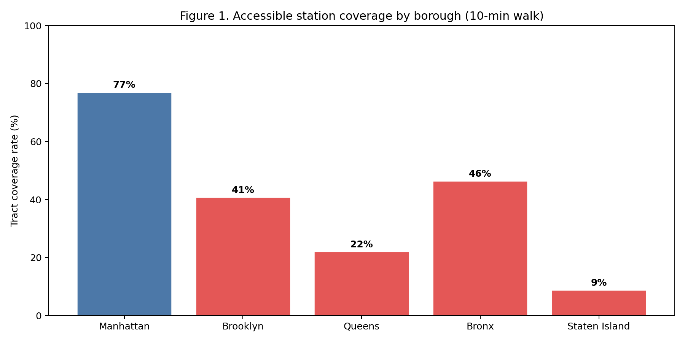
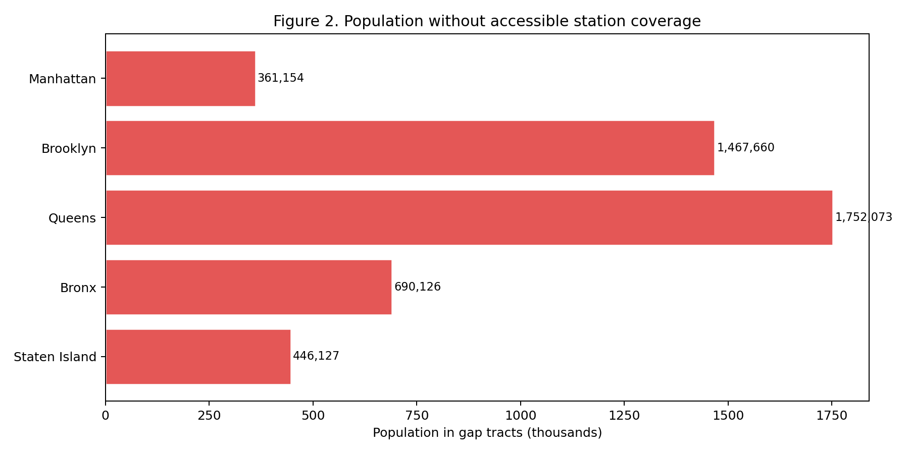
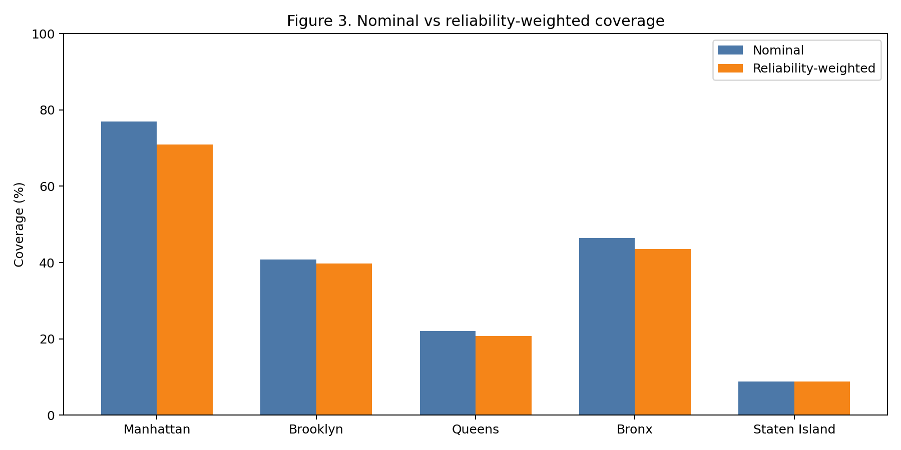
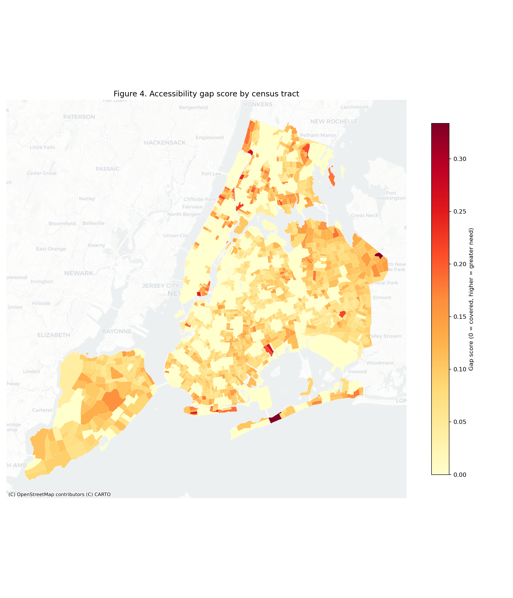
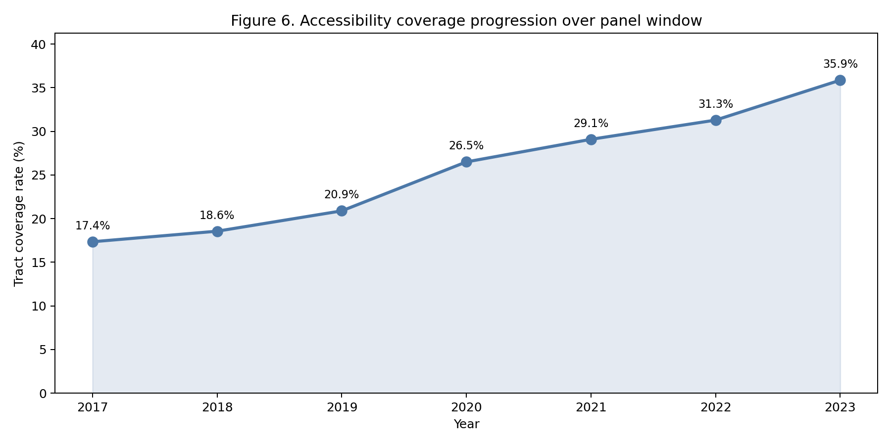
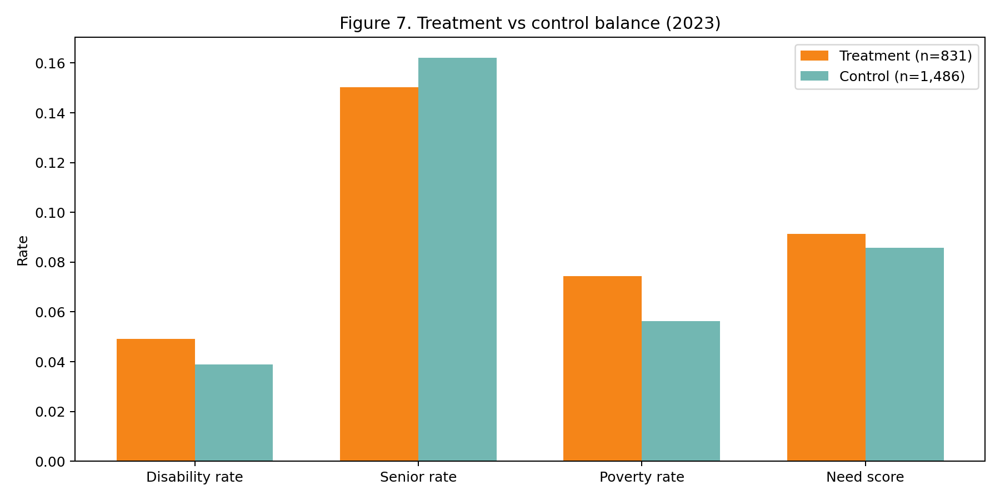
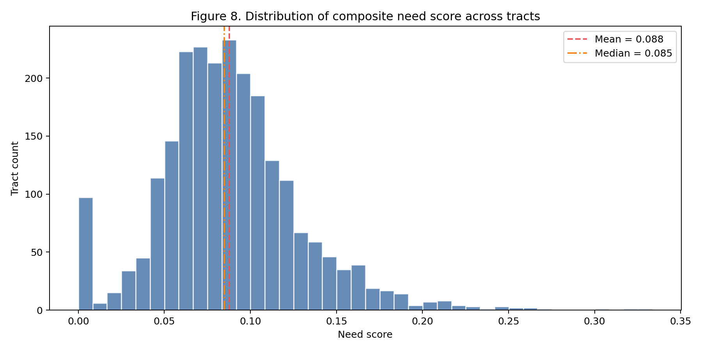
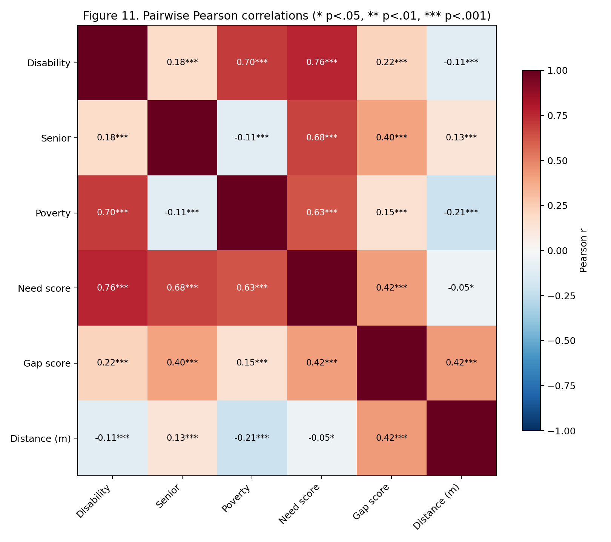
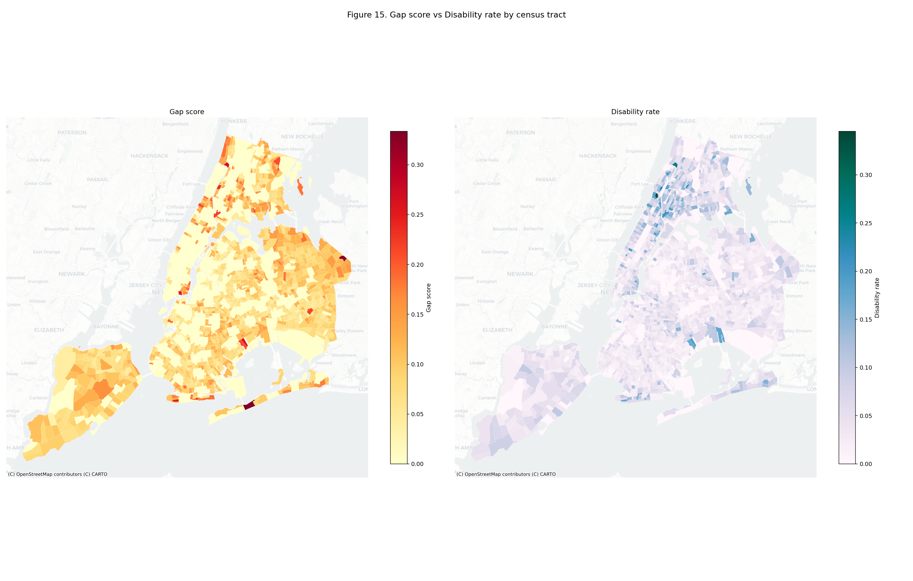

<!-- Author: Blaise Albis-Burdige | https://blaiseab.com -->

# Subway Accessibility in the blaise-website Portfolio: A Pointer, a Gallery, and a Cross-Walk

**By [Blaise Albis-Burdige](https://blaiseab.com)** | Author, [subway-access](https://github.com/random-walks/subway-access)

*April 2026*

---

## Abstract

This showcase is a portfolio wrapper, not a re-implementation. The canonical
NYC subway ADA-accessibility analysis lives upstream in the
[`subway-access`](https://github.com/random-walks/subway-access) v0.5.0
library, whose `docs/CASESTUDY.md` fits the analysis into a single document
with its own factor-factory engine-audit appendix. Here we do three things.
First, we mirror the 15 published figures so they are browsable inside the
blaise-website catalogue without requiring the reader to clone the upstream
repository. Second, we publish an 18-row cross-walk that maps each numbered
section of the upstream CASESTUDY to the `factor-factory` engine family that
owns the canonical implementation and to the portfolio topic other
blaise-website showcases use to reference this one. Third, we record the
headline numbers — 493 stations, 157 ADA-accessible (31.8%), 4,717,140 New
Yorkers in gap tracts (55.4%), OLS *R*² = .202 with senior rate as the
strongest predictor, Moran's *I* = .23 (*z* = 40.87, *p* < .001) — as
structured JSON so downstream consumers (the portfolio index, the OSS
catalogue) can surface them without parsing prose.

*Keywords:* portfolio framing, cross-walk, factor-factory, subway-access,
engine audit, ADA accessibility, NYC subway

## 1. Why this is the thinnest showcase of the three

The blaise-website `python-showcase` package ships three analytical case
studies. Rat-containerization and resolution-equity are primary research —
they fetch data, run the panel and spatial engines, and commit the
resulting tearsheets. Subway-accessibility is different: the underlying
research is already published in the upstream `subway-access` library,
which has its own `docs/CASESTUDY.md`, its own reports, and a dedicated
engine-audit appendix (subway-access v0.5.0 Appendix D). Duplicating it
inside this monorepo would create two sources of truth and two regeneration
paths that would inevitably drift.

The thin-wrapper decision keeps the portfolio coherent. The upstream
library is the executable analysis; this showcase is the blaise-website
lens on it. If the MTA publishes a later station vintage, we update the
upstream package and this showcase becomes a bump commit — replace the 15
PNGs, re-pin the headline-numbers JSON, and re-render the catalogue.

## 2. What the upstream analysis found

At the April 2026 data pull, only 157 of 493 active NYC subway stations
(31.8%) were ADA-accessible. Using an 800 m Euclidean catchment from each
accessible station and overlaying the 2023 five-year ACS, 1,416 of 2,317
census tracts (61.1%) fell in the accessibility gap. The resident
population of those gap tracts totals 4,717,140 — 55.4% of the city's
8,507,596 residents. Queens carries the largest absolute gap (1,752,073
residents, 22% tract coverage). Staten Island has the lowest coverage rate
(9%). Manhattan, at 77% tract coverage, is the exception that makes the
rest of the system look worse by comparison.

The reliability analysis is what separates this study from prior
accessibility research. Of the 157 ADA-designated stations, 49 operated
below 95% elevator uptime over the May 2025–April 2026 observation
window; the most extreme case (59 St-Columbus Circle) logged 0.0% uptime
for the full year. When nominal coverage is uptime-weighted, Manhattan
drops from 77% to 71% — a six-percentage-point reduction in the
best-performing borough. The implication is that capital investment in
new ADA stations without commensurate elevator-maintenance funding
produces nominal compliance that does not translate to functional access.

The equity regression (gap score ~ disability rate + senior rate +
poverty rate, OLS with HC1 standard errors) identifies senior rate as the
strongest predictor (*b* = 0.263, *t*(2313) = 15.93, *p* < .001),
followed by poverty rate (*b* = 0.164, *t* = 4.99, *p* < .001).
Disability rate is not a significant predictor in the multivariate model
(*t* = 0.21, *p* = .84) because of its *r* = .70 correlation with
poverty. Model *R*² = .202, *F*(3, 2313) = 108.83, *p* < .001.

Global Moran's *I* statistics confirm significant positive spatial
autocorrelation: gap score *I* = .23 (*z* = 40.87), need score *I* = .20
(*z* = 33.91), disability rate *I* = .28 (*z* = 48.92), all *p* < .001.
Accessibility gaps do not distribute randomly; they cluster in
identifiable corridors — southeastern Queens, central Brooklyn, the
northern Bronx — amenable to geographically targeted investment.

## 3. What this showcase adds

**The figure gallery.** The 15 committed PNGs in `artifacts/figures/` are
inlined in notebook 02 via `IPython.display.Image` (workaround for
jellycell bug #11, documented in `.claude/skills/jellycell-gotchas.md`).
They are LFS-tracked via the repo-root `.gitattributes`; the `git mv` from
the LEGACY showcase preserves history. Each figure carries a one-sentence
caption linking back to the upstream section so a reader can jump from a
map to the paragraph that defines what it shows.

### 3.1 Gallery

**The cross-walk.** Notebook 03 emits an 18-row table mapping each
upstream section to its `factor-factory` engine family and the
blaise-website portfolio topic it illustrates. The table is the
distinctive contribution of this showcase: it tells a reader browsing the
rat-containerization case study which other case study to read next if
they care about (say) spatial autocorrelation
(`factor_factory.engines.spatial.morans_i`, §4.8) or vertical equity
(`factor_factory.engines.panel_reg.pyfixest_adapter`, §4.7). Sections
without a dedicated estimator (descriptive coverage, discussion,
limitations) are marked with a dash in the engine column; the portfolio
topic is still populated because the methodological choice — how to
write an honest limitations section, how to communicate headline numbers
— is itself a portfolio-level concern.

**The headline-numbers JSON.** The fifteen most-referenced quantitative
results from the upstream CASESTUDY are emitted as structured JSON in
`artifacts/headline_numbers.json`. This lets the blaise-website OSS
catalogue and the portfolio index pull numbers without regex-parsing
the manuscript — which matters when the April 2026 vintage gets bumped
to a later MTA snapshot.

## 4. Limitations of the wrapper framing

A thin wrapper inherits every limitation of the upstream analysis. The
Euclidean 800 m catchment overstates true walking coverage because it
ignores network topology. The ACS vintage is three years stale as of
April 2026. The DiD timeline has sourced upgrade years for only 101 of
157 stations; the remaining 56 use a deterministic hash-based fallback
pending a FOIL request to the MTA Key Station Program. The centroid-based
coverage is a spatial simplification. Equal weighting of the need-score
components is arbitrary. All of these are documented in §5.3 of the
upstream CASESTUDY and should be read there rather than paraphrased here.

This showcase adds one new limitation: the cross-walk is a curation, not
an engine-audit. A real audit would re-estimate every primary result
using the named `factor-factory` engine and report the numerical
discrepancy. The upstream Appendix D does that for the headline
regression and the Moran's *I* test. Extending the audit across every row
of the cross-walk is future work; it belongs upstream in the
`subway-access` engine-audit Appendix rather than here.

## 5. What happens next

The upstream library is the evolution point. When `subway-access` v0.6
ships — with refreshed MTA data, a completed FOIL-sourced upgrade
timeline, or an expanded engine-audit Appendix — this showcase becomes
a bump commit: pin the new version in `packages/python-showcase/pyproject.toml`,
replace the figures in `artifacts/figures/`, update the headline-numbers
JSON, re-render the catalogue. The cross-walk stays largely stable
because `factor-factory` engine names are API-stable across minor
versions.

For readers who want to run the live pipeline rather than browse the
snapshot, `manuscripts/UPSTREAM_REFERENCE.md` carries the clone +
`uv sync` + `python main.py` recipe. The output lands in `reports/`
under the upstream example directory; copy it back here to refresh the
wrapper.

## References

Metropolitan Transportation Authority. (2026). *MTA subway station
catalog and elevator/escalator availability*. NYC Open Data / Socrata.
https://data.ny.gov

U.S. Census Bureau. (2024). *American Community Survey 2019–2023
five-year estimates*. https://www.census.gov/programs-surveys/acs

Albis-Burdige, B. (2026). *subway-access: Typed Python toolkit for NYC
subway accessibility analysis* (v0.5.0) [Computer software]. Random Walks.
https://github.com/random-walks/subway-access

Albis-Burdige, B. (2026). *factor-factory: Protocol-based econometrics
engine registry* (v1.0.2) [Computer software]. Random Walks.
https://github.com/random-walks/factor-factory
